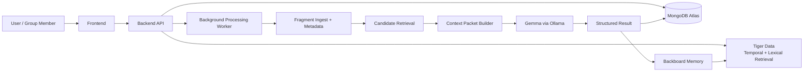

# Architecture design

## Overview

Between Us uses a compact, local-first architecture built around retrieval, candidate ranking, and a small number of focused AI calls.

The critical design choice is that Gemma does not consume the full database. Instead, the system assembles a task-specific Context Packet from a narrow, relevant fragment set and sends that to the model.

## High-level system diagram

## Components

### Frontend

The frontend is responsible for:

The frontend should not become a dashboard for every internal model decision. It should feel like a private memory product, not an ML console.

### Backend API

The backend API owns:

### Background processing worker

The worker handles expensive operations such as:

It runs asynchronously so uploads do not block the user experience.

### Gemma

Gemma is the local reasoning layer. It is used for:

The current local runtime in this environment is:

The first provider boundary is implemented in `src/lib/ai/gemma-provider.ts` in the Next.js/Node runtime. It uses Ollama's non-streaming `/api/chat` endpoint, JSON Schema output mode, optional base64 image inputs, and environment-based endpoint/model configuration. Higher-level operations such as fragment analysis and moment reconstruction should build on this provider rather than call Ollama directly.

### Backboard

Backboard stores confirmed, high-level group memory, with one assistant per group because assistant memory is shared across its threads. Use explicit memory operations and read-only retrieval; do not let it auto-promote speculative Gemma output. MongoDB stores the Backboard assistant/memory IDs and evidence provenance. It should contain:

- people and relationships
- recurring references
- inside jokes
- group-specific terminology
- known aliases
- remembered corrections
- higher-level memory context relevant to future reconstruction

Backboard complements MongoDB and does not replace canonical application state.

Backboard must not contain raw media, private fragments, or unconfirmed moment candidates. Memory writes happen after member confirmation/correction, and group deletion/correction workflows must remove/update the corresponding provider memory.

### MongoDB Atlas

MongoDB Atlas is the canonical application database. It stores the source-of-truth objects for the application, including:

- users
- groups
- group membership
- fragments
- moments
- stories
- entities
- permissions
- processing jobs
- AI observations

It should be the source of truth for operational state. The AI does not own application state directly.

### Tiger Data

Tiger Data is responsible for the derived retrieval index. The initial implementation supports temporal filtering and lexical matching; vector retrieval is deferred until an embedding model is selected and evaluated.

It should support:

- time-window retrieval around a fragment
- lexical matching against extracted semantic summaries
- temporal ranking within a group-scoped candidate set
- efficient search for candidate moments and related stories

### Render

Render hosts the deployment. The initial deployment should be simple and focused:

- frontend
- backend API
- background worker

Only add more services if the architecture truly requires them.

### ElevenLabs

ElevenLabs Scribe is an optional external speech-to-text provider for voice-note fragments only. Calls are server-side and require explicit author opt-in. The transcript is a derived observation linked to the original audio and must be reviewed before group use. If privacy/retention terms or credits are unsuitable, the feature remains disabled; the core product continues on local Gemma.

### Tinker

Tinker is used in a bounded offline specialization experiment after baseline evaluation identifies a concrete weakness. It is not the default runtime model. Supported base-model compatibility, checkpoint sampling, billing, and data handling must be verified against the current Tinker catalog before the experiment. Only synthetic or explicitly de-identified/consented examples may be used.

## Data ownership

The system should separate responsibilities clearly:

- MongoDB: application truth and operational records
- Tiger Data: retrieval index and time-aware search layer
- Backboard: persistent memory and contextual recall
- ElevenLabs: opt-in voice-note transcription only
- Tinker: isolated, measured model-specialization experiment
- Gemma: reasoning over selected candidate context
- Render: deployment/runtime operations

## Failure boundaries

The architecture should isolate failures by layer:

- upload failure: isolated to storage and processing job creation
- retrieval failure: degrade gracefully to simpler candidate search
- AI model failure: return structured uncertainty or retry with narrower context
- persistence failure: do not allow a stale AI result to be treated as fact
- permission failure: deny access at API boundaries without leaking metadata

## Design principles

- Do not send the whole database to Gemma
- Retrieve candidates before reasoning
- Prefer structured outputs over free-form narrative
- Keep evidence attached to every generated conclusion
- Use local Gemma as the default path
- Treat uncertainty as a first-class part of the product
