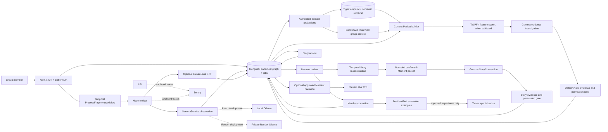

# Architecture: Collective Memory Reconstruction

## Product definition

Between Us is a private, local-first collective memory engine. It turns independent fragments from a group into evidence-backed Moments and evolving Stories. A Moment is not created once and treated as fact: new evidence can add, split, merge, weaken, or strengthen competing hypotheses. Only members can confirm a Moment or Story.

The core loop is:

```text
Fragment -> Observation -> structured memory graph -> temporal/semantic retrieval
          -> bounded Context Packet -> evidence score + Gemma investigation
          -> validated Moment hypotheses -> member correction/confirmation
          -> bounded confirmed-Moment packet -> StoryConnection proposal
          -> evidence/privacy audit -> member review -> evolving memory
```

## Memory objects

- **Fragment:** a text, image, short video, or reviewed voice-transcript contribution with author, group, capture time/timezone, visibility, consent, source, and deletion state. Raw voice audio stays outside Gemma processing.
- **Observation:** uncertain, versioned claims extracted from one Fragment. Every claim records its source fragment, extractor/model version, provenance, and whether it is directly observed or inferred.
- **Moment hypothesis:** a proposed event with evidence links, competing interpretations, uncertainty, and a revision history. It remains provisional until members confirm it.
- **Story:** a member-triggered, evidence-backed candidate relationship among confirmed Moments, with provenance back to those Moments and their eligible source Fragments. Members alone confirm or reject it.
- **Entity and relationship:** group-scoped references to people, places, objects, aliases, and relationships. A name or detected face is not identity proof.
- **Correction:** an attributable member action that confirms, rejects, splits, merges, or changes a hypothesis. It is durable data and a potential evaluation example, not an instruction to silently rewrite evidence.

## System diagram



## Responsibility boundaries

| System | Owns | Explicit boundary and current status |
|---|---|---|
| Next.js + Better Auth | Authenticated UI/API, group membership checks, text and voice-fragment submission, review/correction actions | Server-side authorization is authoritative; never trust client-supplied group membership. Only bounded WAV voice notes are accepted. |
| MongoDB Atlas | Canonical Users, Groups, memberships, Fragments, GridFS voice audio, author-reviewed transcripts, Observations, Moments, Stories, evidence, provenance, and processing jobs | Structured graph/state source of truth. Provider IDs are references, not canonical memory. |
| Gemma 4 via `GemmaService` | Consent-gated text, image/video observations, author-approved voice-transcript observations, bounded Moment investigation, and on-demand StoryConnection proposals | Local development uses Ollama on the developer machine; Render uses a dedicated private Ollama service. Outputs are versioned and evidence-checked. Raw audio is not sent to Gemma. |
| Tiger Data | Derived, group-scoped retrieval projection | MongoDB is authoritative. Current ranking combines time, lexical overlap, extracted entity overlap, and optional indexed Moment links. No embedding model is selected; extracted entities are not confirmed aliases. |
| Backboard | Durable group semantics: aliases, nicknames, inside jokes, recurring references, and meanings | One assistant per group; explicit, confirmed writes only; never raw/private media or speculative claims. Integration remains gated. |
| Temporal | Durable processing, retries, idempotency, member-triggered Story reconstruction, and future scheduled reevaluation | Owns execution, not domain state. Histories contain opaque IDs/status only. A TypeScript client/worker skeleton exists; live service credentials are not configured. |
| Mastra | Optional orchestration of specialized AI steps: observation, retrieval investigation, evidence audit, Story detection, and narration | Potential AI-step coordinator inside a Temporal activity/workflow. It must not create a second durable job/retry system. SDK fit and need are unverified; defer adoption until a bounded prototype proves value. |
| TabPFN | Experimental scoring of structured same-Moment features | A calibrated `P(same_moment)` estimate only after supported runtime/API, dataset size, calibration, and privacy are verified. Not a generic LLM and not a confirmation authority. |
| ElevenLabs | Optional, explicitly consented Scribe voice transcription | Disabled by default; bounded monthly usage caps and server-side author approval are required. TTS/diarization remain out of scope; account retention/terms must be verified before enabling. |
| Tinker | Isolated specialization experiment from member corrections | First build a de-identified evaluation set. Verify current model catalog, compatibility, training/sampling, deletion, and billing; do not claim Gemma compatibility or send raw/private media. |
| Sentry | Tracing of workflow, model, retrieval, scoring, provider calls, latency, and failures | Scrub prompts, outputs, transcripts, media, names, emails, tokens, and request bodies. Correlate via opaque job/Moment IDs. Integration remains gated. |
| Render | Primary web deployment, separate Node processing worker, and private CPU-only Gemma/Ollama service | Inference is isolated from HTTP requests and inaccessible from the public internet. The model service has dedicated compute and a persistent model disk. |
| Future Gemma runtime | Optional implementation of `GemmaService` for a separately approved Gemma 4 E2B host | Add an adapter without changing memory retrieval, validation, persistence, or review. Never substitute a hosted LLM or send raw media to a third-party model API. |
| GitHub Copilot | Development assistance for architecture, implementation, tests, refactors, and debugging | Development tool only, not part of runtime or memory data flow. |
| Entire | Optional coding-session checkpoints and context continuity | Development-only. Never ingest Between Us user media/session secrets. |

## Memory ownership and flow

1. The API authorizes a member, validates text and capture metadata, and persists the canonical Fragment plus ProcessingJob records in MongoDB.
2. Temporal starts idempotent workflows with opaque IDs. Activities retrieve current authorized Fragments or confirmed-Moment context from MongoDB at execution time.
3. Gemma creates a structured, uncertain Observation from consented text or bounded image/video evidence. Voice transcription is a separate opt-in activity; only an author-reviewed transcript may enter Gemma.
4. MongoDB stores observations and graph relationships. Only eligible group-visible projections are indexed in Tiger. Backboard receives a minimal confirmed semantic context, never the structured graph wholesale.
5. Retrieval combines a bounded time window, semantic/lexical similarity when configured, and explicit MongoDB entity/relationship expansion. Backboard contributes only a few relevant confirmed meanings.
6. A Context Packet feeds optional TabPFN scoring and Gemma investigation. A deterministic gate checks group, visibility, consent, deletion state, timestamp plausibility, evidence IDs, and supported relationship types before persistence.
7. MongoDB stores competing hypotheses and revisions. New authorized evidence can trigger convergence; a member action is the only route to `confirmed`.
8. Corrections are stored with actor, action, before/after hypothesis, cited evidence, and consent. Eligible de-identified structured examples may later enter a Tinker evaluation/experiment set.

## Memory convergence

Do not force ambiguous fragments into one answer. Keep multiple candidate hypotheses with evidence and uncertainty. New fragments and member corrections may revise their support; preserve prior revisions and why they changed. Temporal may schedule reevaluation only after its cost, retention, and user-notification behavior are specified. A numeric score never changes `possible` or `likely` into `confirmed`; confirmation belongs to members.

## Failure and privacy boundaries

- MongoDB is canonical; Tiger and Backboard are derived and rebuildable. Provider outages cannot erase canonical corrections or block private text capture unless a required durable-processing gate explicitly rejects the operation.
- External integrations are disabled until account terms, retention, budgets, and consent are verified. No silent paid fallback.
- Private or restricted fragments never enter group retrieval, Context Packets, provider context, or group Moments by inference.
- Text and group metadata are scoped to group/visibility/author checks. Legacy media objects, if any, are not reachable through the app and require manual cleanup from their former storage bucket.
- Temporal retries only idempotent activities. Workflow inputs/results contain opaque IDs/status, not media, transcripts, prompt bodies, or Context Packets.
- Sentry failure never blocks product actions. Telemetry is scrubbed before export.
- If evidence, authorization, storage, or validation is unavailable, fail closed or return `unknown`; do not persist an unsupported Moment.
