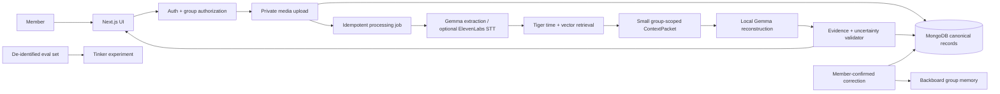

# Final MVP Implementation Plan

## Product target

Ship the smallest trustworthy Between Us product that lets multiple members of a private group contribute fragments and later see those fragments reconstructed into a candidate shared moment, with inspectable evidence, explicit uncertainty, correction, and deletion.

The final MVP proves:

```text
private group
  -> members upload fragments
  -> authorized fragments are analyzed and indexed
  -> the system retrieves a small candidate set
  -> Gemma proposes a moment with evidence
  -> deterministic checks validate the proposal
  -> the group sees the moment, sources, uncertainty, and correction controls
```

A moment is the main product object. This is not a public feed, generic chatbot, AI photo-captioner, or semester-recap generator.

## MVP scope

### Required product capabilities

- Sign in, create a private group, invite members, and enforce membership on every read/write.
- Upload photos, screenshots, short videos, text, and optional voice notes.
- Set visibility and AI-processing consent per fragment; private and restricted fragments never enter group candidate retrieval by inference alone.
- Show upload/processing state and a chronological fragment view.
- Extract structured fragment observations with provenance.
- Retrieve candidates using group + time window + semantic similarity + people/place/entity overlap.
- Reconstruct a candidate Moment through local Gemma using a compact ContextPacket.
- Validate cited fragment IDs, group/visibility permissions, timestamps, relationship types, contradictions, and uncertainty before persistence.
- Let members inspect evidence, reject a merge, correct an interpretation, and confirm a moment.
- Store confirmed group corrections and stable aliases as group-scoped Backboard memories with MongoDB provenance.
- Provide an opt-in ElevenLabs speech-to-text path for voice-note fragments, subject to the consent and retention gate below.
- Evaluate a Tinker specialization experiment against the local Gemma baseline; keep the app's default inference path local Gemma.

### Explicitly out of scope

- Public profiles, followers, likes, comments, or a recommendation feed.
- Generic "chat with all memories" as the primary interface.
- Automatic confirmation of AI-created moments.
- Voice cloning, synthetic voices, AI music, or generated recap films.
- Sending private media, raw group histories, or personally identifiable uploads to Tinker.
- Using a Tinker checkpoint in production unless the experiment passes its gate and the data/privacy review approves it.
- Stories/recurring-pattern mining as a release blocker. Preserve the schema for a later phase.

## Architecture and ownership

| System | MVP responsibility | Must not own |
|---|---|---|
| Next.js App Router + Node.js/TypeScript | UI, authenticated API routes, upload orchestration, provider adapters | Client-visible secrets or authorization decisions in the browser |
| MongoDB Atlas | Canonical users, groups, membership, fragment metadata, visibility/consent, observations, moments, evidence, corrections, jobs, provider references | Vector retrieval source of truth |
| Private media storage | Raw image/audio/video bytes, addressed through an adapter and short-lived authorized URLs | Group permissions or AI interpretations |
| Tiger Data | Derived group-visible time/vector/lexical retrieval projection | Raw media, permissions, canonical moment state |
| Gemma via local Ollama | Default fragment understanding and moment reconstruction | Full-database access or persistent application state |
| Backboard | High-level, explicitly confirmed group memory: aliases, recurring references, approved corrections | Raw media, speculative claims, private member memory, canonical state |
| ElevenLabs | Opt-in speech transcription for voice-note fragments only | Default processing for other media, memory storage, generated voice |
| Tinker | Time-boxed training/sampling experiment on approved de-identified examples | Default app request path or unapproved personal media |
| Render | Next.js web service and Node processing worker | Durable work state without MongoDB job records |

### Data path



MongoDB is authoritative. Tiger and Backboard are derived/context services that can be rebuilt or reconciled from authorized MongoDB state and provenance records. Backboard service failure must not block normal fragment uploads or erase MongoDB state.

## Implementation phases

### Phase 0: Freeze access, budgets, and unresolved decisions

Do this before consuming provider credits or implementing external integrations.

- Confirm actual remaining Backboard, Tinker, and ElevenLabs credits, expiry, allowed use, rate limits, and billing behavior from the developer accounts. The plan does not assume credits are unlimited or still active.
- Set an explicit maximum spend for each provider. Add usage logging and a feature flag before any billable call.
- Review provider data retention/training terms. ElevenLabs documents zero-retention mode as enterprise-only; do not send real voice notes until consent, retention, and deletion terms are acceptable.
- Check Tinker's live supported-model catalog and whether the local Gemma 4 model/weights can be used. Do not assume Gemma compatibility. Confirm sampling/checkpoint options and billing for the account.
- Choose the production identity provider and private object-storage provider. Keep both behind interfaces; do not store production media on ephemeral Render disk.
- Lock fragment size/type limits, visibility defaults, and consent text.
- Design the key product screens and UI tokens before implementing their final layouts.

**Exit gate:** written decisions for identity, media storage, provider credit caps, data-sharing/retention, and model compatibility. No real personal media has been sent to a third party yet.

### Phase 1: Trust foundation and real group boundaries

- Implement authentication, group creation/invites, membership roles, and server-side authorization helpers.
- Add tests proving users cannot enumerate or retrieve another group's fragments, moments, evidence, or Backboard assistant ID.
- Add per-fragment visibility and explicit AI-use consent. Default to private until the member chooses group visibility and eligible processing.
- Create deletion states and provenance links so dependent observations, retrieval entries, Backboard memories, and stored media can be removed or invalidated.
- Add server-only configuration and secret validation.

**Exit gate:** two test groups remain isolated across API, Mongo queries, retrieval, object URLs, and provider context.

### Phase 2: Ingestion, storage, and processing jobs

- Implement private signed uploads for images, screenshots, and short videos; store bytes in the selected private object store and metadata in MongoDB.
- Add text-fragment creation and capture-time/time-zone handling.
- Store source, author, group, visibility, consent, MIME type, capture time, checksum, and processing version.
- Create idempotent Mongo-backed jobs with bounded retries for extraction, embedding, candidate search, reconstruction, and deletion cleanup.
- Enforce file-size/duration limits and validate MIME types from file content, not only client headers.

**Exit gate:** uploads survive server restarts, duplicate job retries do not create duplicate fragments, and a deletion request removes the source object and marks dependent AI state stale.

### Phase 3: Baseline intelligence and temporal/vector retrieval

- Keep the local Ollama Gemma provider as the default path; add fragment-analysis contracts and model/version tracking.
- Process photos/screenshots with supported image input. For short video, extract a small, documented set of keyframes and analyze only those; do not send whole archives or unnecessary frames.
- Extract observations as uncertain AI data: visible/textual content, likely activity, candidate place/entity references, and source/evidence IDs. Do not identify a person by face without a separately approved consent and safety design.
- Select and document a local embedding model after a small retrieval-quality test. Include dimensions, latency, license, and compatibility with Tiger Data. Keep a no-vector temporal/lexical fallback.
- Write only group-visible eligible fragment projections to Tiger Data. Rank by time, semantic similarity, shared confirmed entities/aliases, and known moment links.
- Build a bounded ContextPacket with a top-N candidate cap and evidence/visibility constraints.

**Exit gate:** the same-event versus unrelated-event evaluation set demonstrates better retrieval than the current temporal/lexical demo without cross-group or private-fragment leakage.

### Phase 4: Moment reconstruction, evidence, and correction

- Ask Gemma for schema-constrained candidate summaries, evidence links, contradictions, missing evidence, and uncertainty notes.
- Validate IDs and permissions against MongoDB, not just model output. Validate relationship types using stored observations; reject unsupported links.
- Derive `unknown`, `possible`, or `likely` with documented deterministic evidence rules. A model score never upgrades a label. `confirmed` is only a member action.
- Persist candidate moments, evidence references, model version, retrieval version, and validation outcome in MongoDB.
- Implement the member review flow: confirm, reject/merge, correct a person/place/reference, and remove a fragment from a moment.
- Reflect a confirmed correction into Backboard only after authorization and explicit confirmation. Keep its memory ID and Mongo provenance for update/delete.

**Exit gate:** no unsupported evidence can be persisted; insufficient evidence returns unknown; corrections are durable and reversible/auditable.

### Phase 5: Backboard group memory integration

- Create one Backboard assistant per Between Us group and map its `assistant_id` in MongoDB. The assistant boundary is essential because Backboard memories are shared across all threads under one assistant.
- Store only high-level group facts members confirmed: group aliases, stable place names, recurring references, and accepted corrections. Do not send raw media, private fragments, or speculative moment text.
- Prefer explicit `addMemory`/`searchMemories`/`updateMemory`/`deleteMemory` operations. Use read-only retrieval for reconstruction; do not use automatic write-on-every-message memory for unreviewed interpretations.
- Retrieve only a few relevant memories and include them in the ContextPacket with provenance.
- Handle asynchronous memory operations; write operation references/status into MongoDB and do not treat a pending write as durable.
- On member removal, group deletion, or memory correction, apply the documented cleanup and verify deletion through the provider API.

**Exit gate:** group A cannot retrieve group B memory; only confirmed facts are written; memory removal is reflected in Backboard and Mongo provenance.

### Phase 6: Optional voice-note input through ElevenLabs

- Add voice notes as an opt-in Fragment type. Keep voice disabled until the Phase 0 privacy/retention gate is approved.
- Upload audio to Between Us storage first; queue transcription in the background. Send only that audio file and minimal required options to ElevenLabs Scribe via the server-side API.
- Show the transcript to the author for review/correction before it becomes group-visible or is used for shared reconstruction.
- Preserve the original audio as the evidence source, transcript text as a derived observation, and any word timestamps as source offsets.
- Make clear that voice is being sent to a cloud processor; do not treat an API setting as zero retention unless the account is eligible for it.
- Use a strict clip/duration cap and credit budget. If credits run out or consent is absent, keep the voice fragment private/unprocessed or offer manual transcription; never silently switch to a paid service.
- Do not add voice cloning or TTS to the MVP.

**Exit gate:** author consent is recorded, transcription can be edited, the transcript remains linked to the source audio, and usage/credit exhaustion does not break other uploads.

### Phase 7: Tinker specialization experiment

This is an MVP experiment deliverable, not a production dependency.

- First freeze a Gemma baseline and a labeled evaluation set containing same-event pairs, unrelated-nearby pairs, misleading text, insufficient evidence, and diverse media types.
- Use synthetic or explicitly de-identified/consented training examples only. Do not upload raw group media, private fragments, names, or live Backboard memories.
- Check current Tinker catalog and account entitlement. If Gemma 4 is unsupported, choose a supported small instruction model only for a comparison experiment; keep local Gemma as production default.
- Train one small supervised/LoRA specialization for one measured weakness, likely moment candidate grouping or evidence selection. Keep the training script/workspace separate from the Next.js app runtime.
- The official Tinker quickstart currently documents a Python SDK. Keep the deployed application Node-only; use the Tinker console or an isolated research workspace for the experiment. If a Node-compatible supported training path cannot be verified and the project constraint is Node-only for all tooling, defer Tinker training rather than adding a Python service.
- Use a project-isolated Tinker workspace, set a spend ceiling, log training/sample/checkpoint usage, and store no credentials in the repository.
- Compare the Tinker checkpoint on a held-out set with the Gemma baseline. Track pairwise grouping precision/recall, false merges, evidence-ID validity, uncertainty behavior, latency, and spend.
- Adopt the Tinker model in production only if it passes a pre-agreed improvement threshold, does not worsen false merges or hallucination/evidence failures, has a compatible inference route, fits privacy requirements, and is cheaper/valuable within the credit cap. Otherwise publish the experiment result and leave Gemma as the runtime model.

**Exit gate:** reproducible baseline-vs-Tinker report and an explicit adopt/defer decision. Tinker spend never exceeds the approved cap.

### Phase 8: The expressive product UI

Start the visual system in Phase 0 and implement it in parallel with the backend; do not leave all UX until the end.

#### Visual direction: Memory Atlas

Make the interface bold and emotionally alive, but keep evidence and privacy unmistakable. Avoid generic dashboard cards and avoid turning it into an ML console.

- Use a tactile, editorial visual language: warm paper, deep ink-green, electric cobalt, citrus-lime, and coral accents; strong serif display typography paired with precise mono timestamps and compact sans-serif controls.
- Make real fragment media the visual anchor. Use a timeline/atlas canvas where separate contributions align by time and the evidence connections become visible as the moment is reconstructed.
- Give each contributor a consistent, accessible color/key, while never relying on color alone for identity or evidence.
- Use an immersive moment detail view: clear title and uncertainty, source fragments arranged along a time rail, visible provenance links, and an expandable "why these connect" layer.
- Make the group timeline the working first screen: upload entry point, recent moments, and unresolved candidate moments. No marketing landing page.
- Build high-utility responsive flows: quick capture/upload on mobile; evidence comparison and corrections on desktop; explicit private/group visibility controls in the upload flow.
- Add a few purposeful motions: fragments align into a moment, evidence links draw in, and corrections update the reconstruction. Respect reduced-motion preferences and keep a static accessible equivalent.
- Keep button labels, uncertainty explanations, and evidence text readable; provide keyboard, focus, screen-reader, and high-contrast states.

#### MVP screens

1. **Group space:** memory timeline, upload/capture action, processing status, candidate moments.
2. **Add fragment:** image/video/text/voice input, capture time, visibility, AI-consent toggle, and upload status.
3. **Moment reconstruction:** concise summary, uncertainty label/reason, contributors, timeline, source fragments, and evidence relationships.
4. **Review/correct:** confirm/reject, change a group alias/person reference, remove a fragment, or explain "not enough evidence."
5. **Group memory:** review/manage confirmed aliases and recurring references backed by member corrections.

**Exit gate:** usability test with at least three people who did not build the product; they can upload, understand why a candidate appeared, identify uncertainty, correct/reject it, and distinguish private from group-visible media.

### Phase 9: Evaluation, deployment, and pilot

- Evaluate on a held-out, labeled dataset (target: 50–100 fragments across multiple small events and unrelated near-neighbors). Include spec cases: same place/different event, same people/different event, misleading text, single uploader, mixed media, and insufficient evidence.
- Require 100% valid evidence IDs after server validation, zero cross-group leaks, zero private-fragment evidence leakage, and no confirmed moment without explicit member action. Track false merges and misses; block launch if false merges exceed the agreed pilot threshold.
- Test provider outage, malformed Gemma output, Backboard timeout, ElevenLabs quota exhaustion, queue retries, media deletion, and duplicate uploads.
- Deploy a Next.js web service plus a Node worker to Render; MongoDB is canonical, Tiger is rebuildable, Backboard and external speech providers have explicit timeout/fallback behavior.
- Start with an invite-only pilot group, collect corrections and user-perceived errors, and re-run the eval set before widening access.

**Release gate:** all privacy/evidence acceptance checks pass; one complete multi-user upload-to-moment workflow succeeds in staging; provider cost caps and deletion checks are confirmed.

## Provider and credit policy

- Check actual balance, expiration, billing triggers, and account terms for every free-credit grant before coding a live integration.
- Put provider calls behind server-side interfaces, feature flags, usage accounting, and hard per-provider/monthly limits.
- Do not place keys in `NEXT_PUBLIC_*` variables, logs, browser bundles, prompts, or sample files.
- Keep local Gemma the default. External services are called only for their named use case with the user/group's consent.
- Credit exhaustion degrades optional voice/Tinker features, not core uploads or memory access.

## Critical path

```text
Access + privacy decisions
  -> authentication + group isolation
  -> secure media storage + jobs
  -> Gemma baseline + eval data
  -> Tiger retrieval + Moment validation
  -> Backboard confirmed group memory
  -> final UI + correction flow
  -> ElevenLabs opt-in voice lane
  -> Tinker benchmark/training experiment
  -> Render pilot + release gate
```

Build and test the UI shell alongside the first four engineering phases. ElevenLabs and Tinker are isolated work packages and must not block the core image/text fragment-to-moment path.

## References checked for planning

- [Backboard persistent memory](https://backboard-docs.docsalot.dev/sdk/memory.md) and [assistant/thread architecture](https://backboard-docs.docsalot.dev/concepts/architecture.md)
- [Tinker quickstart](https://tinker-docs.thinkingmachines.ai/tinker/quickstart/), [current model catalog](https://tinker-docs.thinkingmachines.ai/tinker/models.json), and [data isolation/permissions](https://tinker-docs.thinkingmachines.ai/tinker/data-model/)
- [ElevenLabs speech-to-text API](https://elevenlabs.io/docs/api-reference/speech-to-text/convert) and [model capabilities](https://elevenlabs.io/docs/overview)
- [Next.js local documentation](node_modules/next/dist/docs/01-app/03-api-reference/03-file-conventions/route.md)
